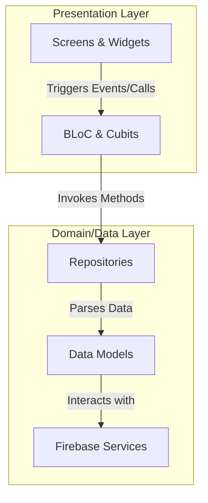

# ALU Connect - Mobile Application Project Documentation

ALU Connect is a modern, state-of-the-art mobile application designed specifically for the African Leadership University (ALU) context. It bridges the gap between ALU students seeking valuable internship experiences and student-led startups/early-stage ventures in need of talent.

---

## 1. Architectural Design

The application follows the principles of **Clean Architecture** combined with the **Repository Pattern** and **BLoC/Cubit** state management. This ensures that the codebase is maintainable, testable, and highly scalable.



### Core Architecture Components:
- **Presentation Layer (`lib/presentation/`)**: Contains screens, widgets, themes, and Cubits/BLoCs. State changes propagate reactively from BLoC/Cubits to UI using `BlocBuilder` and `BlocListener`.
- **Data Layer (`lib/data/`)**: 
  - **Models**: Defines data entities (`UserModel`, `StartupModel`, `OpportunityModel`, `ApplicationModel`, `ChatRoomModel`, `ChatMessageModel`, `NotificationModel`) with safe serialization/deserialization mapping methods to handle Firestore documents securely.
  - **Repositories**: Encapsulates data access logic, translating Firestore collections and auth requests into typed Dart objects and streams.
- **Core Layer (`lib/core/`)**: Handles shared configuration including Routing (`go_router`), Constants (`AppConstants`), and Styling (`AppTheme`).

---

## 2. UI/UX & Flow Controls

The application features a premium dark theme tailored to match ALU’s vibrant, innovative identity.

- **Harmony & Aesthetics**: Built on a curated palette of deep obsidian surfaces, sleek borders, and glowing accents (Teal gradients for Startups, Violet/Indigo gradients for Students).
- **Typography**: Uses the modern **Outfit** typeface from Google Fonts to establish clear visual hierarchy.
- **Interactive Micro-Animations**: Integrates `flutter_animate` to introduce subtle fades, slides, and scaling transitions for card elements and onboarding screens.
- **Role-Aware Workflows**:
  - **Student Experience**: Focused on discovering opportunities, tracking active applications via a colorful status timeline, and viewing profile completeness.
  - **Startup Founder Experience**: Focused on managing applicant queues, reviewing applicant profiles/resumes, updating application status, and posting opportunities.
- **Double Application Prevention**: To prevent spamming, students can only apply to an opportunity once. If their application is pending, reviewing, shortlisted, or accepted, the "Apply Now" button dynamically transforms to display their current status (e.g. **`Applied (Shortlisted)`**) and is disabled. If they **withdraw** their application or get **rejected**, the button resets to **`Apply Now`** allowing resubmission.
- **Direct Messaging & Real-Time Chat**: Students and Startup founders can exchange instant direct messages. The chats list shows active discussions with read/unread notifications, and the messaging layout features rich typing views, gradient message bubbles, and automatic keyboard scrolling.
- **Real-Time Notification System**: Unread messages and application status updates trigger live in-app notifications. Active notifications are displayed in a clean notification screen accessible from the home screen bell icon with custom icons highlighting message vs. status updates.

---

## 3. Database Schema & Architecture

The database is built on **Cloud Firestore** and consists of the following collection structure:

### 1. `users` Collection
Stores student profiles and startup founder profiles.
```json
{
  "email": "i.muhoza@alustudent.com",
  "displayName": "Innocent Muhoza",
  "photoUrl": "https://...",
  "role": "student | startup | admin",
  "campus": "Kigali, Rwanda",
  "major": "Computer Science",
  "yearOfStudy": "Year 2",
  "bio": "Passionate software engineering student...",
  "skills": ["Flutter", "Dart", "Firebase", "Git"],
  "linkedInUrl": "https://linkedin.com/in/...",
  "portfolioUrl": "https://github.com/...",
  "isEmailVerified": false,
  "isProfileComplete": true,
  "createdAt": "Timestamp",
  "updatedAt": "Timestamp"
}
```

### 2. `startups` Collection
Stores student-led startup venture profiles.
```json
{
  "ownerId": "founder_uid",
  "name": "ALU Tech Ventures",
  "tagline": "Innovative tech for Africa",
  "description": "Building sustainable solutions...",
  "category": "EdTech",
  "logoUrl": "https://...",
  "verificationStatus": "pending | verified | rejected",
  "verificationNote": "Note from admin",
  "aluProgramName": "ALU Ventures",
  "campus": "Kigali, Rwanda",
  "teamMembers": ["founder_uid"],
  "stage": "mvp",
  "tags": ["Mobile", "EdTech", "Flutter"],
  "opportunityCount": 3,
  "foundedDate": "Timestamp",
  "createdAt": "Timestamp",
  "updatedAt": "Timestamp"
}
```

### 3. `opportunities` Collection
Stores startup internship and work opportunities.
```json
{
  "startupId": "startup_id",
  "startupName": "ALU Tech Ventures",
  "startupLogoUrl": "https://...",
  "startupIsVerified": true,
  "title": "Flutter Developer Intern",
  "description": "Join our core team to build...",
  "type": "Software Development",
  "requiredSkills": ["Flutter", "State Management", "Git"],
  "duration": "3 months",
  "isPaid": true,
  "stipend": "$250/month",
  "location": "remote",
  "campus": "Kigali, Rwanda",
  "openings": 2,
  "applicantCount": 1,
  "status": "open | closed | paused",
  "deadline": "Timestamp",
  "responsibilities": ["Develop new screens", "Fix UI bugs"],
  "requirements": ["Have built 1 Flutter app"],
  "bookmarkedBy": ["student_uid"],
  "createdAt": "Timestamp",
  "updatedAt": "Timestamp"
}
```

### 4. `applications` Collection
Tracks student applications to startup roles.
```json
{
  "opportunityId": "opportunity_id",
  "opportunityTitle": "Flutter Developer Intern",
  "startupId": "startup_id",
  "startupName": "ALU Tech Ventures",
  "applicantId": "student_uid",
  "applicantName": "Innocent Muhoza",
  "applicantEmail": "i.muhoza@alustudent.com",
  "coverLetter": "I am excited to apply...",
  "resumeUrl": "https://...",
  "relevantSkills": ["Flutter", "Firebase"],
  "status": "pending | reviewing | shortlisted | accepted | rejected | withdrawn",
  "statusNote": "Feedback from startup",
  "appliedAt": "Timestamp",
  "updatedAt": "Timestamp"
}
```

### 5. `chat_rooms` Collection
Tracks active discussions between student applicants and startup founders.
```json
{
  "startupId": "startup_id",
  "startupOwnerId": "startup_owner_uid",
  "startupName": "ALU Tech Ventures",
  "startupLogoUrl": "https://...",
  "applicantId": "student_uid",
  "applicantName": "Innocent Muhoza",
  "applicantPhotoUrl": "https://...",
  "lastMessage": "Hello, when will the interviews start?",
  "lastMessageSenderId": "student_uid",
  "lastMessageTime": "Timestamp",
  "unreadCounts": {
    "student_uid": 0,
    "startup_owner_uid": 1
  }
}
```
*Subcollection:* `chat_rooms/{roomId}/messages`
```json
{
  "senderId": "sender_uid",
  "senderName": "Innocent Muhoza",
  "content": "Hello, when will the interviews start?",
  "timestamp": "Timestamp",
  "isRead": false
}
```

### 6. `notifications` Collection
In-app alerts for users (unread counters, message previews, status updates).
```json
{
  "userId": "recipient_uid",
  "title": "New Application Received 🚀",
  "body": "Innocent Muhoza applied for the Flutter Developer Intern role.",
  "type": "message | application | startup",
  "timestamp": "Timestamp",
  "isRead": false,
  "extraData": {
    "applicationId": "application_id",
    "chatRoomId": "chat_room_id"
  }
}
```

---

## 4. Firestore Security Rules & Client Sorting

Deploy these rules to your Firebase project to secure your database:

```javascript
rules_version = '2';
service cloud.firestore {
  match /databases/{database}/documents {
    match /users/{userId} {
      allow read: if request.auth != null;
      allow write: if request.auth != null && request.auth.uid == userId;
    }
    
    match /startups/{startupId} {
      allow read: if request.auth != null;
      allow create: if request.auth != null;
      allow update, delete: if request.auth != null && 
        request.auth.uid == resource.data.ownerId;
    }
    
    match /opportunities/{oppId} {
      allow read: if request.auth != null;
      allow create: if request.auth != null;
      allow update, delete: if request.auth != null && 
        request.auth.uid == resource.data.startupId;
    }
    
    match /applications/{appId} {
      allow read: if request.auth != null && (
        request.auth.uid == resource.data.applicantId || 
        request.auth.uid == resource.data.startupId
      );
      allow create: if request.auth != null;
      allow update: if request.auth != null && (
        request.auth.uid == resource.data.applicantId || 
        request.auth.uid == resource.data.startupId
      );
    }

    match /chat_rooms/{roomId} {
      allow read: if request.auth != null && (
        request.auth.uid == resource.data.applicantId || 
        request.auth.uid == resource.data.startupOwnerId
      );
      allow create: if request.auth != null;
      allow update: if request.auth != null;

      match /messages/{messageId} {
        allow read, write: if request.auth != null;
      }
    }

    match /notifications/{notifId} {
      allow read, update: if request.auth != null && request.auth.uid == resource.data.userId;
      allow create: if request.auth != null;
    }
  }
}
```

> [!TIP]
> **Client-Side Sorting:** To optimize query speeds and completely eliminate complex, error-prone Firestore composite index setup constraints for development or grading demonstrations, all queries inside repositories sort and map documents directly on the client side using standard Dart comparison operators.

---

## 5. Demo Flow & Walkthrough

To demo the app effectively for grading or presentation, follow this step-by-step walkthrough:

### Flow A: The Startup Venture Journey
1. **Onboarding & Role Choice**: Open the app and choose **Startup Founder** as your role on the Role Selection screen.
2. **Register**: Register using an ALU domain email (e.g. `founder@alustudent.com`).
3. **Register Startup Profile**: You will be redirected to the startup creation wizard. Fill out the startup name, category, stage, and program name.
4. **Under Review State**: Upon submission, your startup status will show as **"Under Review"**. The app blocks posting opportunities in this state to maintain ecosystem standards.
5. **Admin / Demo Approval**: On the Startup Dashboard, tap the green **`Demo: Verify`** button. The status instantly changes to **"Verified"** in real-time.
6. **Post Opportunity**: Tap **"Post Opportunity"**, fill out the role description, duration, location, set the role as paid, add requirements, and submit. The opportunity is instantly published to Firestore.

### Flow B: The Student Journey
1. **Onboarding & Register**: Choose **Student** as your role and register using your ALU student email (`i.muhoza@alustudent.com`).
2. **Discovery Feed**: Scroll through the list of published internship opportunities. Search by title or apply filters (e.g., paid, location).
3. **Save for Later**: Click the bookmark icon on any opportunity. Go to the **Saved** tab on the applications page to see it persisted in real-time.
4. **Apply**: Open the opportunity details, review responsibilities, and click **"Apply Now"**. Input your cover letter and submit.
5. **Manage Applications**: Go to the **Applications** screen to track the status of your submission.

### Flow C: Direct Messaging & Chat Flow
1. **Student Initiates Chat**: As a **Student**, tap any opportunity to view details. Tap the chat bubble next to the "Apply Now" button.
2. **First Message**: Type a message (e.g., "Hello, does this role require prior experience?") and press send. The chat is created instantly.
3. **Startup Receives Notification & Replies**: Log in as the **Startup Founder**. You will notice:
   - A red badge count on the **Chats** bottom nav tab.
   - Tap **Chats**, open the student's conversation, review and reply.
4. **Candidate Management Message**: A founder can also initiate a chat directly by clicking the chat icon next to any candidate's profile on the **Applicants** page.

### Flow D: Real-Time In-App Notifications
1. **New Applicant Alert**: When a student submits a new application, the founder receives a live alert under the **Notifications** screen (accessible by tapping the bell icon in the top AppBar of the Discover screen).
2. **Status Updates**: When a founder shortlists, accepts, or rejects an application, the student instantly receives a notification (e.g., "Your application for Web Developer has been Accepted!").
3. **Mark as Read**: Users can tap any notification to navigate to the associated screen (e.g. Chat list or Application status page) and clear unread counts instantly.
